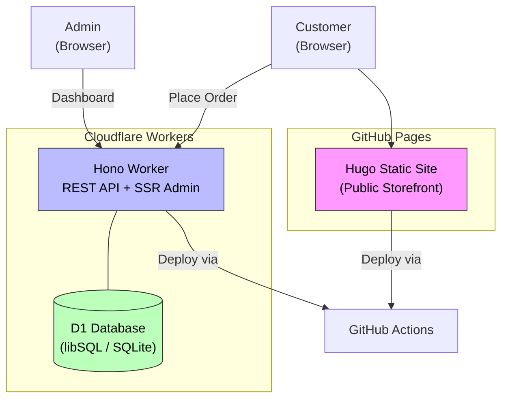
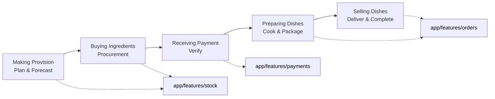

# SoulFood

> Online takeaway management for South African comfort food.

**SoulFood** streamlines the management of a small to medium online takeaway catering business — handling orders, menus, payments, and deliveries efficiently for caterers serving from the comfort of their kitchen.

## Mission

Empower owners, managers and operators with tools to run their business from a cellphone:

- Instant order notifications for operators
- Basic delivery notifications for clients
- Daily, weekly & monthly reports
- Stock and inventory management

## Project Structure

```
soulFood/
├── site/              # Public storefront (Hugo static site)
├── app/               # Backend + Admin UI (Hono + D1 on Cloudflare Workers)
│   ├── src/features/  # Feature modules (menu, orders, stock, reporting, payments)
│   └── src/admin/     # Server-rendered admin dashboard (Hono SSR)
├── docs/              # Documentation
└── .github/workflows/ # CI/CD pipelines
```

## System Architecture



## Business Process



## Quick Links

| Section | Description |
|---|---|
| [Architecture](architecture.md) | System design, stack decisions, trade-offs |
| [Getting Started](getting-started.md) | Local development setup |
| [Product Requirements](product-requirements.md) | PRD and scope |
| [Processes](processes/overview.md) | Business process documentation |
| [Features](features/order-management.md) | Feature specifications |
| [Database Schema](database/schema.md) | D1 table definitions |
| [API Reference](api/README.md) | Endpoint documentation |

## Tech Stack

| Layer | Technology | Why |
|---|---|---|
| **Public site** | Hugo (static) | Fast, cheap, portable — ideal for a menu/brochure site |
| **Backend API** | HonoJS (TypeScript) | Lightweight, edge-native, great Cloudflare DX |
| **Database** | D1 (libSQL / SQLite) | Serverless SQLite — zero ops, generous free tier |
| **Admin UI** | Hono SSR (JSX) | Same worker as API — no separate frontend deploy |
| **Auth** | Simple token/middleware | Admin-only, no complex auth needed |
| **Deploy** | GitHub Actions → Cloudflare Workers + Pages | Fully automated CI/CD |

---

*Last updated: June 2026*
