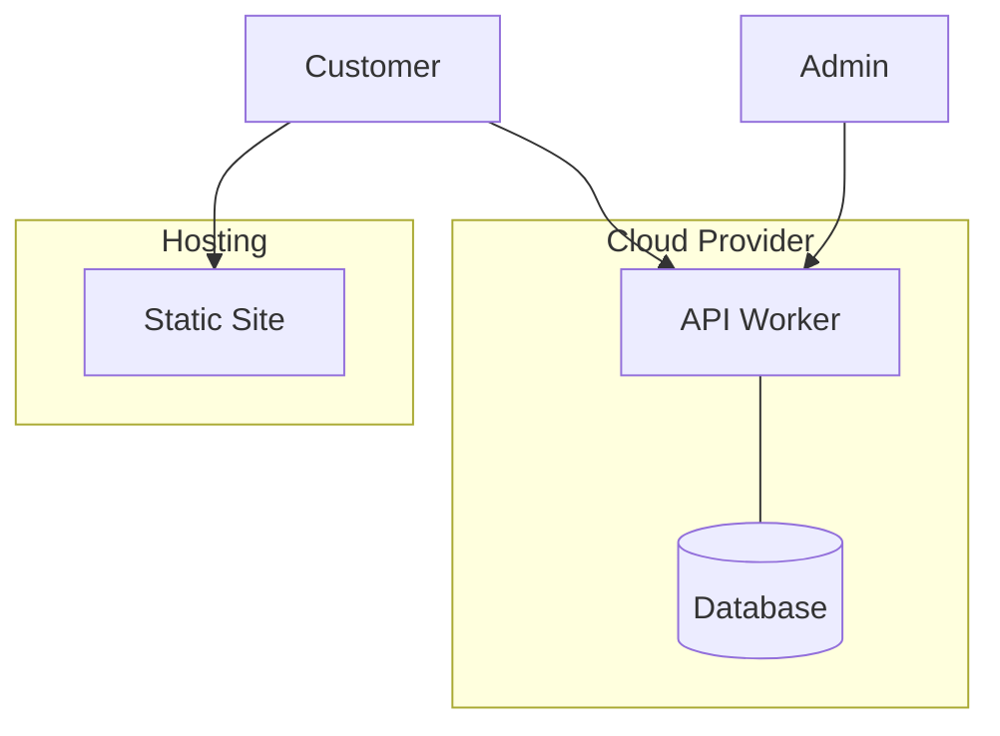

# Architecture

## System Diagram

## Stack Decisions

| Decision | Choice | Rationale |
|---|---|---|
| Backend framework | — | — |
| Database | — | — |
| Frontend | — | — |
| Hosting | — | — |
| Auth | — | — |

## Data Flow

Describe how requests flow through the system.
