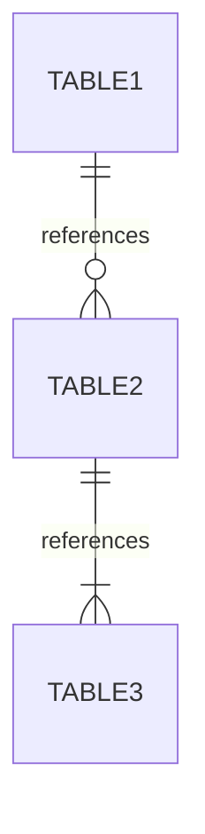

# Database Schema

## Entity-Relationship

## Tables

### `table_name`

| Column | Type | Constraints | Description |
|---|---|---|---|
| id | INTEGER | PK, AUTOINCREMENT | Primary key |
| created_at | TEXT | DEFAULT datetime('now') | Creation timestamp |

## Indexes

- `idx_table_column` on `table_name(column)`
