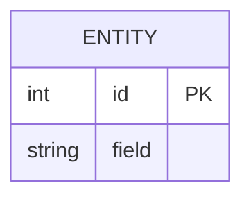

# Feature: [Name]

## Purpose

One paragraph describing what this feature does and why it exists.

## Data Model



## API Endpoints

| Method | Path | Auth | Description |
|---|---|---|---|
| GET | /api/resource | — | List |
| POST | /api/resource | Required | Create |

## State Machine

```mermaid
stateDiagram-v1
    [*] --> State1
    State1 --> State2
    State2 --> [*]
```

## Business Rules

- Rule 1
- Rule 2

## Error Handling

- 400 — description
- 404 — description
