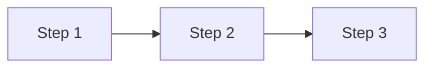

# Process: [Name]

## Trigger

What starts this process.

## Flow

## Details

### Step 1 — Title
- **Actor:** Who performs it
- **System:** What the system does
- **Outcome:** Expected result

### Step 2 — Title
...

## Error States

- What happens when something goes wrong at each step.
