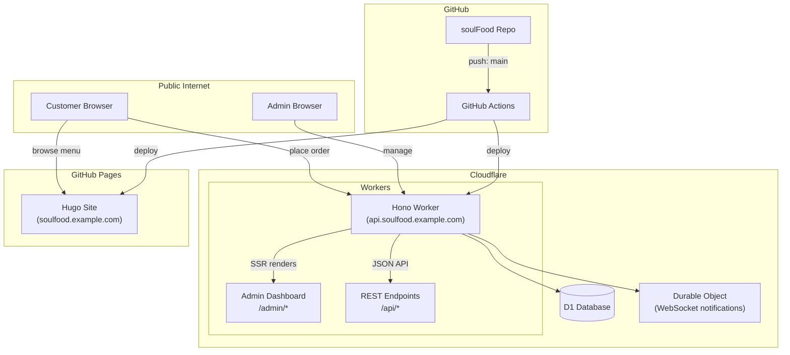
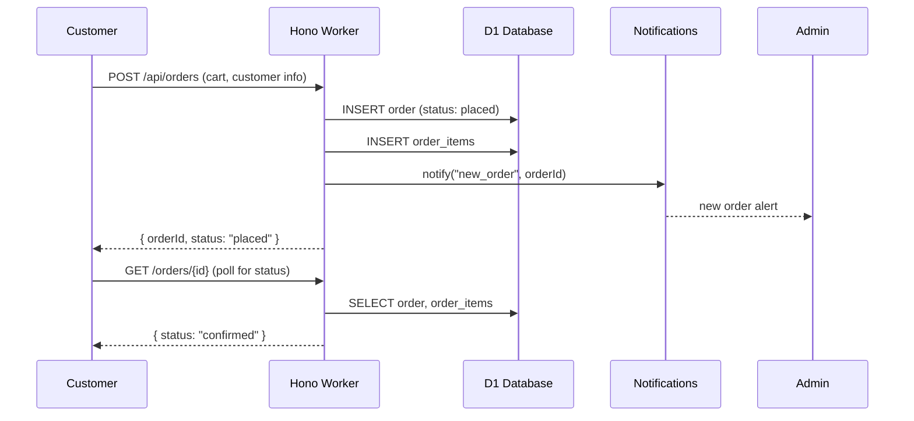

# Architecture

## System Diagram



## Stack Decisions

### Why Hono + D1 on Cloudflare Workers?

| Requirement | Choice | Alternative Considered |
|---|---|---|
| Serverless, zero ops | Cloudflare Workers | Vercel, Railway |
| TypeScript end-to-end | HonoJS | Express, Fastify |
| SQLite-compatible, serverless | D1 (libSQL) | PlanetScale, Turso |
| Admin UI without extra deploy | Hono SSR (JSX) | Nuxt SPA, React SPA |

**Trade-off:** Hono SSR means the admin dashboard is server-rendered. No client-side routing, no SPA interactivity — but zero extra infra, same deploy pipeline, and the dashboard doesn't need to be a SPA for a takeaway shop.

### Why polling over WebSockets?

For a single-location takeaway operating 8-10 hours/day, polling every 10 seconds is ~3,600 requests/day — well within Cloudflare Workers' 100k/day free tier. WebSockets via Durable Objects add complexity (state management, reconnection handling) that isn't justified until you have multiple concurrent admin sessions needing sub-second updates.

The `notifications` module is designed with a swappable transport:

```typescript
interface NotificationTransport {
  notify(orderId: string, event: OrderEvent): Promise<void>
}
```

Polling is the initial implementation; WebSockets via Durable Objects can be swapped in later without changing the rest of the system.

### Why Hugo for the public site?

The public site is a brochure — menu, about, blog, contact. It's static content that barely changes. Hugo generates it in milliseconds, serves from GitHub Pages for free, and doesn't need a database. The alternative of serving it from the Hono worker would add complexity for zero benefit.

## Data Flow

### Order Placement



## Security

- Admin routes (`/admin/*`) protected by `auth` middleware
- Simple token-based auth (env var, no user management for v1)
- API endpoints validate input with Zod schemas
- D1 queries use parameterized statements (SQL injection prevention)
- CORS restricted to known origins

## Future Considerations

- **Multi-tenant** — D1 supports separate DB per tenant or tenant_id column
- **WebSocket upgrade** — swap polling transport for Durable Objects
- **Payment providers** — implement the `PaymentProvider` interface for Yoco/PayFast/Stripe
- **Image uploads** — Cloudflare Images or R2 for menu photos
- **Offline fallback** — Cloudflare Workers can cache D1 queries at the edge

---

*Last updated: June 2026*
