# Database Schema

## Overview

SoulFood uses **D1** (Cloudflare's serverless SQLite, based on libSQL). All tables are defined in `app/src/db/schema.ts` and migrations live in `app/migrations/`.

## Entity Relationship Diagram

```mermaid
erDiagram
    menu_categories ||--o{ menu_items : contains
    menu_items ||--o{ order_items : "line items"
    orders ||--o{ order_items : has
    orders ||--o{ order_status_log : tracks
    orders ||--o| transactions : pays
    orders ||--o| customers : "placed by"
    customers ||--o{ orders : places
    ingredients ||--o{ purchase_order_items : "ordered in"
    suppliers ||--o{ purchase_orders : supplies
    purchase_orders ||--o{ purchase_order_items : contains

    menu_categories {
        integer id PK
        text name "e.g. Mains, Sides, Beverages"
        integer sort_order "display ordering"
        boolean available
        datetime created_at
    }

    menu_items {
        integer id PK
        text name "e.g. Mogodu Wednesday"
        text description
        real price
        integer category_id FK
        text image "URL to photo"
        integer prep_time_minutes
        boolean available
        text starch "starch choice text, e.g. Creamy Samp or Steamed Bread"
        text ingredients_list "comma-separated ingredient refs"
        integer stock_keep_unit "internal SKU"
        datetime created_at
        datetime updated_at
    }

    menu_specials {
        integer id PK
        integer menu_item_id FK
        text day_of_week "MON,TUE,WED,THU,FRI,SAT,SUN"
        real special_price
        boolean active
    }

    customers {
        integer id PK
        text name "latest known name"
        text phone "unique identifier"
        text delivery_address "latest address"
        text notes "latest notes"
        integer total_orders "count of orders placed"
        datetime last_order_at
        datetime created_at
        datetime updated_at
    }

    orders {
        integer id PK
        integer customer_id FK "reference to customers table"
        text customer_name "snapshot of name at order time"
        text phone "snapshot of phone at order time"
        text delivery_address "snapshot of address at order time"
        text notes "special instructions"
        text status "placed|confirmed|preparing|ready|out_for_delivery|delivered|cancelled"
        real total
        text payment_status "pending|verified|captured|refunded|failed"
        text payment_method "cash|card|eft"
        datetime created_at
        datetime updated_at
    }

    order_items {
        integer id PK
        integer order_id FK
        integer menu_item_id FK
        text item_name "snapshot including starch choice, e.g. Mogodu Wednesday (Creamy Samp)"
        integer quantity
        real unit_price
    }

    order_status_log {
        integer id PK
        integer order_id FK
        text from_status
        text to_status
        text changed_by "system|customer|operator"
        datetime created_at
    }

    transactions {
        integer id PK
        integer order_id FK
        text provider "yoco|payfast|stripe|cash"
        text provider_tx_id "external reference"
        real amount
        text status "pending|completed|failed|refunded"
        text currency "ZAR"
        datetime created_at
        datetime updated_at
    }

    ingredients {
        integer id PK
        text name
        text unit "kg|L|pieces|packets"
        real current_stock
        real min_stock_level
        real max_stock_level
        real reorder_quantity
        real unit_cost "latest cost for margin calculation"
        integer supplier_id FK "preferred supplier"
        datetime created_at
        datetime updated_at
    }

    suppliers {
        integer id PK
        text name
        text contact_person
        text phone
        text email
        integer lead_time_days
        boolean active
        datetime created_at
    }

    purchase_orders {
        integer id PK
        integer supplier_id FK
        text status "draft|sent|received|cancelled"
        real total
        datetime expected_delivery
        datetime received_at
        datetime created_at
    }

    purchase_order_items {
        integer id PK
        integer purchase_order_id FK
        integer ingredient_id FK
        real quantity_ordered
        real quantity_received
        real unit_price
    }
```



## Table Details

### `menu_categories`

Groups menu items for display on the public site and admin dashboard.

| Column | Type | Notes |
|---|---|---|
| `id` | INTEGER | Primary key, auto-increment |
| `name` | TEXT | Required |
| `sort_order` | INTEGER | Controls display order (ASC) |
| `available` | BOOLEAN | Soft delete / hide |

### `menu_items`

Each dish or product sold by the business.

| Column | Type | Notes |
|---|---|---|
| `id` | INTEGER | Primary key, auto-increment |
| `name` | TEXT | Required |
| `description` | TEXT | Short description shown on menu |
| `price` | REAL | ZAR, required |
| `category_id` | INTEGER | FK → `menu_categories.id` |
| `prep_time_minutes` | INTEGER | Used for ETA calculation |
| `starch` | TEXT | Starch choice description (e.g. "Creamy Samp or Steamed Bread") |
| `ingredients_list` | TEXT | Comma-separated ingredient names (loose coupling to `ingredients`) |
| `stock_keep_unit` | INTEGER | Internal ID for stock tracking |

### `customers`

Auto-created and updated by the order API. Each phone number maps to one customer record. When a repeat order comes in, `total_orders` increments, `last_order_at` refreshes, and `name`/`delivery_address`/`notes` are updated to the latest values.

| Column | Type | Notes |
|---|---|---|
| `id` | INTEGER | Primary key, auto-increment |
| `name` | TEXT | Latest known name |
| `phone` | TEXT | Unique index — identifies the customer |
| `delivery_address` | TEXT | Latest known address |
| `notes` | TEXT | Latest order notes |
| `total_orders` | INTEGER | Number of orders placed (starts at 1) |
| `last_order_at` | TEXT | Timestamp of most recent order |

### `orders`

Core business entity — tracks every customer order through its lifecycle. Each order links to a `customers` record via `customer_id` (nullable for legacy orders).

| Column | Type | Notes |
|---|---|---|
| `id` | INTEGER | Primary key, auto-increment |
| `customer_id` | INTEGER | FK → `customers.id` |
| `customer_name` | TEXT | Snapshot at order time |
| `phone` | TEXT | Snapshot at order time |
| `delivery_address` | TEXT | Snapshot at order time |
| `notes` | TEXT | Special instructions |

**Status lifecycle:**

```
placed → confirmed → preparing → ready → out_for_delivery → delivered
  ↓         ↓
cancelled  cancelled
```

### `order_status_log`

Audit trail. Every status change is recorded with a timestamp and actor.

### `transactions`

Payment records. The `provider` column identifies which payment gateway handled the transaction. The `status` column tracks the payment lifecycle independent of the order lifecycle.

### `ingredients`

Inventory tracking. `current_stock` decreases as dishes are prepared (deducted via recipe relationships, initially manual). `min_stock_level` triggers reorder alerts.

### `purchase_orders`

Procurement workflow. Connects `suppliers` to `ingredients` via `purchase_order_items`.

## Migrations

Migrations are SQL files in `app/migrations/` named sequentially:

```
001_create_tables.sql      — All core tables (categories, items, orders, ingredients, etc.)
002_add_starch.sql         — Adds starch column to menu_items
003_add_customers.sql      — Creates customers table, adds customer_id to orders
```

Migrations are applied automatically at Worker startup by `init-db.ts` (uses `CREATE TABLE IF NOT EXISTS` + `ALTER TABLE ADD COLUMN` with try/catch for idempotency). You can also run them manually:

```bash
# Local (default DB)
wrangler d1 execute soulfood --local --file=migrations/001_create_tables.sql
wrangler d1 execute soulfood --local --file=migrations/002_add_starch.sql
wrangler d1 execute soulfood --local --file=migrations/003_add_customers.sql

# Local (dev environment DB)
wrangler d1 execute soulfood-dev -e dev --local --file=migrations/001_create_tables.sql
wrangler d1 execute soulfood-dev -e dev --local --file=migrations/002_add_starch.sql
wrangler d1 execute soulfood-dev -e dev --local --file=migrations/003_add_customers.sql

# Production
wrangler d1 execute soulfood --remote --file=migrations/001_create_tables.sql
wrangler d1 execute soulfood --remote --file=migrations/002_add_starch.sql
wrangler d1 execute soulfood --remote --file=migrations/003_add_customers.sql
```

## Indexes

```sql
CREATE INDEX idx_orders_status ON orders(status);
CREATE INDEX idx_orders_created ON orders(created_at);
CREATE INDEX idx_orders_customer ON orders(customer_id);
CREATE INDEX idx_order_items_order ON order_items(order_id);
CREATE INDEX idx_menu_items_category ON menu_items(category_id);
CREATE INDEX idx_ingredients_stock ON ingredients(current_stock);
CREATE INDEX idx_order_status_log_order ON order_status_log(order_id);
CREATE UNIQUE INDEX idx_customers_phone ON customers(phone);
```

---

*Last updated: June 2026*
