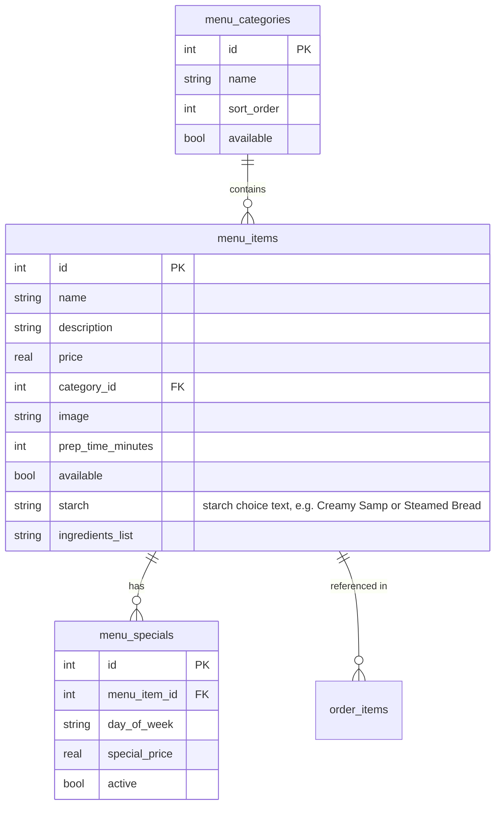

# Menu Management

## Introduction

Menu management handles creating, organizing, and maintaining the dishes offered for sale — categories, pricing, descriptions, and availability.

## Data Model



## Dynamic Menu Rendering

The storefront no longer renders the menu statically from Hugo YAML data. Instead, `site/static/js/menu.js` fetches the menu on every page load:

```http
GET /api/public/menu
```

Returns all available categories with their items. Items with `price = 0` (e.g. "Market Price") are excluded. The JS renders items into `<div id="dynamic-menu">` organized by category with "Choice of Starch" displayed when available.

Both the API and Hugo servers must be running in development — the menu depends on the API.

## Starch Choice

The `starch` field on a menu item describes available starch options (e.g. "Creamy Samp or Steamed Bread"). The client-side cart logic (`cart.js`) parses this field at add-to-cart time:

- **Single option or empty** — item added directly
- **Multiple options** (contains " or ") — a picker modal appears for the customer to choose

The chosen starch is stored per cart item and included in the order payload as part of `itemName`.

## Images

The `image` field stores a URL to a photo of the dish. Photos are displayed in the admin menu management table (as clickable "View" links). Future: upload via R2 signed URLs.

## Admin API Endpoints

All admin menu endpoints require authentication (`Authorization: Bearer <token>`).

| Method | Path | Description |
|---|---|---|
| `GET` | `/api/menu/categories` | List all categories |
| `POST` | `/api/menu/categories` | Create category |
| `PATCH` | `/api/menu/categories/:id` | Update category |
| `DELETE` | `/api/menu/categories/:id` | Delete category |
| `GET` | `/api/menu/items` | List items (filterable by category) |
| `POST` | `/api/menu/items` | Create menu item |
| `PATCH` | `/api/menu/items/:id` | Update menu item |
| `DELETE` | `/api/menu/items/:id` | Archive item |
| `GET` | `/api/menu/specials` | List daily specials |
| `POST` | `/api/menu/specials` | Set a special |

## Category Management

Categories organize dishes for easier browsing. Current categories:

- Main Course
- Side Dish
- Hot Beverages
- Drinks
- Dessert

## Pricing Strategy

The system uses a base price per menu item. Daily specials override the base price with a `special_price` on specific days. This allows:

- **Mogodu Wednesday** — tripe special every Wednesday
- **Umleqwa Friday** — hardbody chicken every Friday
- **Sunday Kos** — full meal deal on Sundays

## Admin Features

1. **Menu editor** — CRUD for categories and items
2. **Image upload** — Attach photos to menu items
3. **Availability toggle** — Quick enable/disable items
4. **Daily specials** — Set day-specific pricing
5. **Reorder categories** — Drag-and-drop sorting

---

*Last updated: June 2026*
