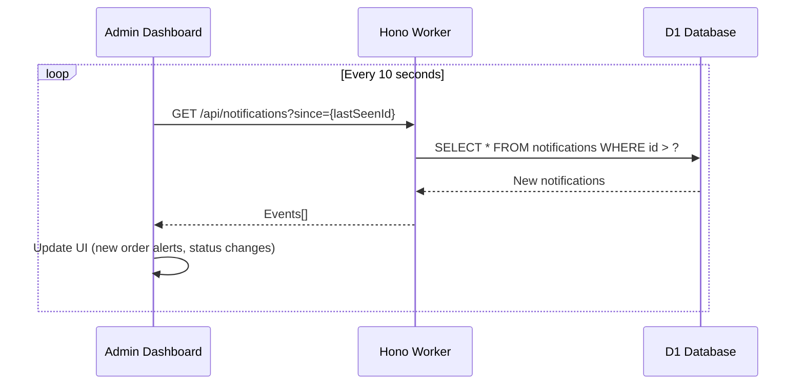
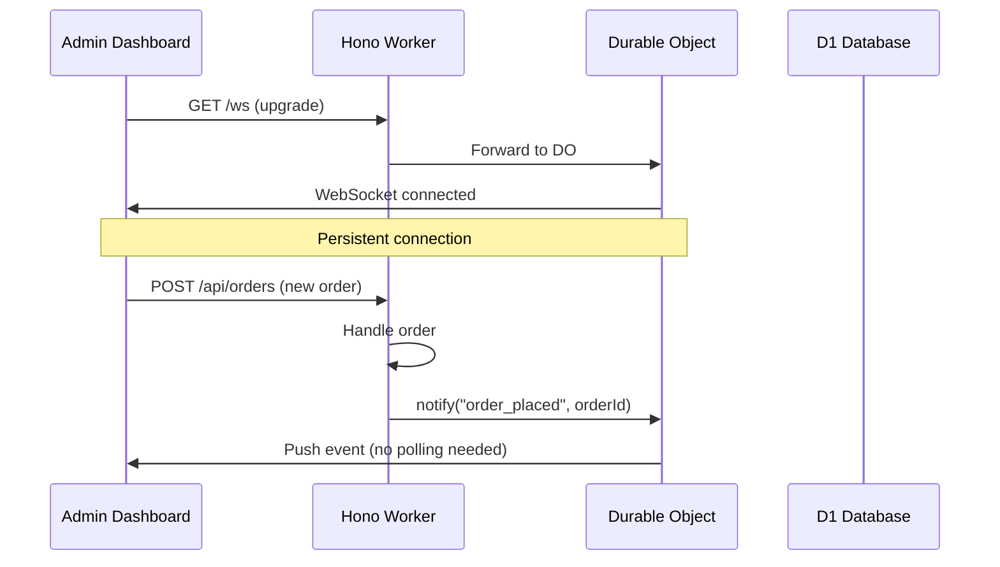

# Notifications

## Introduction

Notifications keep operators and customers informed of order status changes. The system uses a polling-based transport with an interface designed to support WebSockets later.

## Transport Architecture

```typescript
interface NotificationTransport {
  name: string
  send(recipient: Recipient, event: NotificationEvent): Promise<void>
}

interface NotificationEvent {
  type: "order_placed" | "order_confirmed" | "order_preparing"
      | "order_ready" | "order_out_for_delivery" | "order_delivered"
      | "order_cancelled"
  orderId: number
  timestamp: string
  data?: Record<string, unknown>
}
```

## Current Implementation: Polling

The admin dashboard polls for new events:



### Polling Endpoint

| Method | Path | Description |
|---|---|---|
| `GET` | `/api/notifications?since={id}` | Get notifications since given ID |
| `POST` | `/api/notifications/ack` | Mark notifications as seen |

### Database Table

```sql
CREATE TABLE notifications (
    id INTEGER PRIMARY KEY AUTOINCREMENT,
    type TEXT NOT NULL,
    order_id INTEGER NOT NULL,
    message TEXT,
    acknowledged INTEGER DEFAULT 0,
    created_at TEXT DEFAULT (datetime('now'))
);

CREATE INDEX idx_notifications_created ON notifications(created_at);
CREATE INDEX idx_notifications_ack ON notifications(acknowledged);
```

## Notification Events

| Event | Recipient | Message |
|---|---|---|
| `order_placed` | Operator | "New order #42 from Thandi" |
| `order_confirmed` | Customer | "Your order #42 is confirmed" |
| `order_preparing` | Customer | "Your order #42 is being prepared" |
| `order_ready` | Customer | "Your order #42 is ready!" |
| `order_out_for_delivery` | Customer | "Your order #42 is on the way!" |
| `order_delivered` | Customer | "Enjoy your meal!" |
| `order_cancelled` | Customer | "Your order #42 was cancelled" |
| `stock_alert` | Operator | "Chicken stock is below minimum" |

## Future: WebSocket Upgrade

When the polling approach needs upgrading, WebSockets via Durable Objects can be swapped in:



The transport interface makes this a drop-in replacement — just change which transport class is registered.

---

*Last updated: June 2026*
