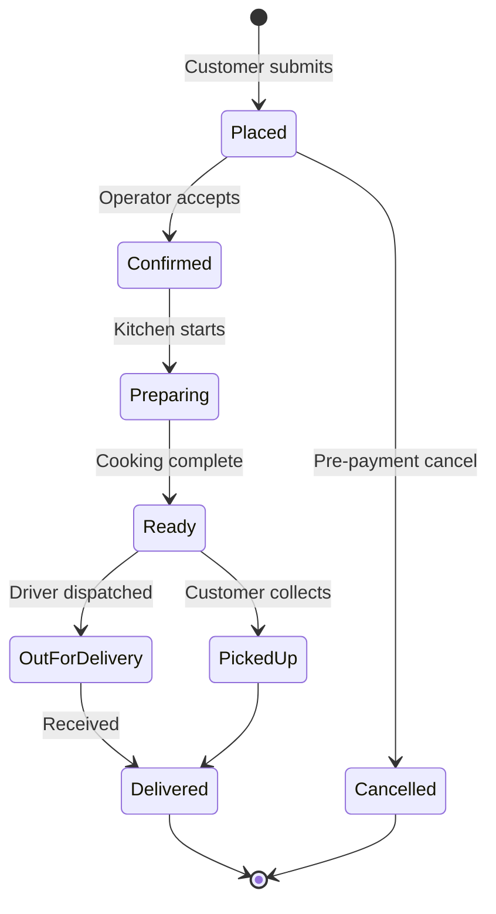

# Order Management

## Introduction

Order management handles incoming orders from the online storefront, tracking their status from placement through delivery completion.

## Order Lifecycle



## State Transitions

| From | To | Who | Trigger |
|---|---|---|---|
| `placed` | `confirmed` | Operator | Clicks "Accept" in dashboard |
| `placed` | `cancelled` | Customer/System | Cancel before cut-off |
| `confirmed` | `preparing` | Operator | Clicks "Start Preparing" |
| `confirmed` | `cancelled` | Operator | Cancel after review |
| `preparing` | `ready` | Operator | Clicks "Mark Ready" |
| `ready` | `out_for_delivery` | Operator | Assign driver |
| `ready` | `picked_up` | Operator | Customer collects |
| `out_for_delivery` | `delivered` | Operator | Confirm delivery |
| `picked_up` | `delivered` | System | Auto-complete |

## API Endpoints

| Method | Path | Description |
|---|---|---|
| `POST` | `/api/orders` | Create new order (customer) |
| `GET` | `/api/orders` | List orders (admin, filterable) |
| `GET` | `/api/orders/:id` | Get order details |
| `PATCH` | `/api/orders/:id/status` | Update order status (admin) |
| `DELETE` | `/api/orders/:id` | Cancel order |

## Order Data Structure

```typescript
interface Order {
  id: number
  customerName: string
  phone: string
  deliveryAddress?: string
  notes?: string
  status: OrderStatus
  total: number
  paymentStatus: PaymentStatus
  paymentMethod: string
  items: OrderItem[]
  statusLog: StatusLogEntry[]
  createdAt: string
  updatedAt: string
}

type OrderStatus =
  | "placed"
  | "confirmed"
  | "preparing"
  | "ready"
  | "out_for_delivery"
  | "delivered"
  | "cancelled"
```

## Customers

Every order upserts a customer record by phone number:

- **New phone** → a `customers` row is created with `total_orders = 1`
- **Repeat phone** → `name`, `delivery_address`, and `notes` are updated to the latest values, `total_orders` increments, `last_order_at` refreshes

The `customers` table has a unique index on `phone`, making it safe to query by phone for repeat customer recognition.

## Starch Choice

Menu items with a starch field containing "or" (e.g. "Creamy Samp or Steamed Bread") trigger a client-side picker when the customer clicks "Add to Cart":

1. A modal appears listing the starch options parsed from the field
2. Customer selects one, then the item is added to the cart with the choice attached
3. The cart displays the starch choice per item (e.g. "Mogodu Wednesday — Creamy Samp")
4. Items are keyed on `id::starch`, so the same dish with different starches are separate line items

The chosen starch is appended to the item name in the order payload (`itemName: "Mogodu Wednesday (Creamy Samp)"`) and in the WhatsApp message.

## Storefront Integration

The Hugo site's cart drawer submits orders via two channels:

1. **API** — `POST /api/orders` saves the order to D1 (name, phone, address, items, total); customer record is upserted by phone
2. **WhatsApp** — `wa.me/0694660013` opens with a human-readable order summary including the order number from the API response

### Checkout Flow

1. Customer adds items → clicks "Place Order"
2. Checkout form slides into the drawer (name, phone, delivery address, notes)
3. "Submit Order" POSTs to the API, then opens WhatsApp with the confirmation
4. Cart clears on success; inline error shown on failure
5. Customer details (name, phone, address, notes) are saved to `localStorage` (`soulfood_checkout`) and pre-filled in the form on the next visit

## Customer Communication

Notifications fire automatically on status transitions (see [Notifications](notifications.md)).

## Admin Dashboard

The admin dashboard (Hono SSR) provides:

1. **Order list** — Filterable by status, searchable by customer name
2. **Order detail** — Full order info with status history
3. **Status actions** — Buttons to advance order through lifecycle
4. **New order alert** — Visual/audio alert when orders come in (polling-based)

---

*Last updated: June 2026*
