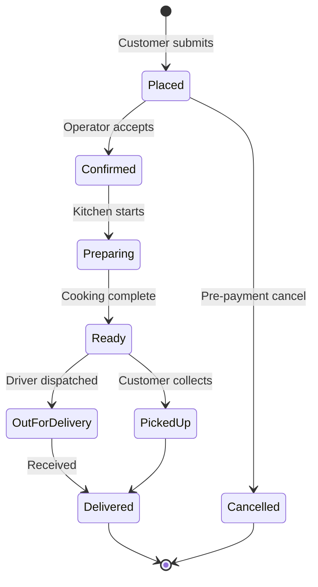

# Order Management

## Introduction

Order management handles incoming orders from the online storefront, tracking their status from placement through delivery completion.

## Order Lifecycle



## State Transitions

| From | To | Who | Trigger |
|---|---|---|---|
| `placed` | `confirmed` | Operator | Clicks "Accept" in dashboard |
| `placed` | `cancelled` | Customer/System | Cancel before cut-off |
| `confirmed` | `preparing` | Operator | Clicks "Start Preparing" |
| `confirmed` | `cancelled` | Operator | Cancel after review |
| `preparing` | `ready` | Operator | Clicks "Mark Ready" |
| `ready` | `out_for_delivery` | Operator | Assign driver |
| `ready` | `picked_up` | Operator | Customer collects |
| `out_for_delivery` | `delivered` | Operator | Confirm delivery |
| `picked_up` | `delivered` | System | Auto-complete |

## API Endpoints

| Method | Path | Description |
|---|---|---|
| `POST` | `/api/orders` | Create new order (customer) |
| `GET` | `/api/orders` | List orders (admin, filterable) |
| `GET` | `/api/orders/:id` | Get order details |
| `PATCH` | `/api/orders/:id/status` | Update order status (admin) |
| `DELETE` | `/api/orders/:id` | Cancel order |

## Order Data Structure

```typescript
interface Order {
  id: number
  customerName: string
  phone: string
  deliveryAddress?: string
  notes?: string
  status: OrderStatus
  total: number
  paymentStatus: PaymentStatus
  paymentMethod: string
  items: OrderItem[]
  statusLog: StatusLogEntry[]
  createdAt: string
  updatedAt: string
}

type OrderStatus =
  | "placed"
  | "confirmed"
  | "preparing"
  | "ready"
  | "out_for_delivery"
  | "delivered"
  | "cancelled"
```

## Customer Communication

Notifications fire automatically on status transitions (see [Notifications](notifications.md)).

## Admin Dashboard

The admin dashboard (Hono SSR) provides:

1. **Order list** — Filterable by status, searchable by customer name
2. **Order detail** — Full order info with status history
3. **Status actions** — Buttons to advance order through lifecycle
4. **New order alert** — Visual/audio alert when orders come in (polling-based)

---

*Last updated: June 2026*
