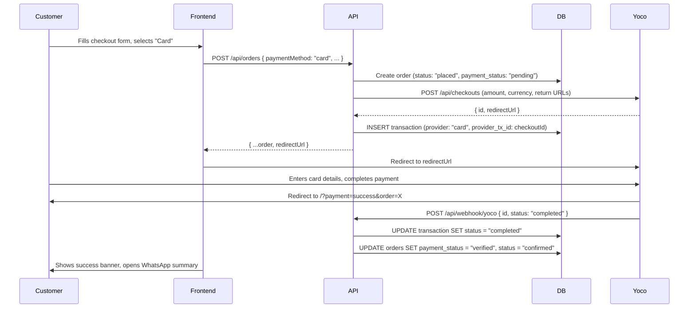
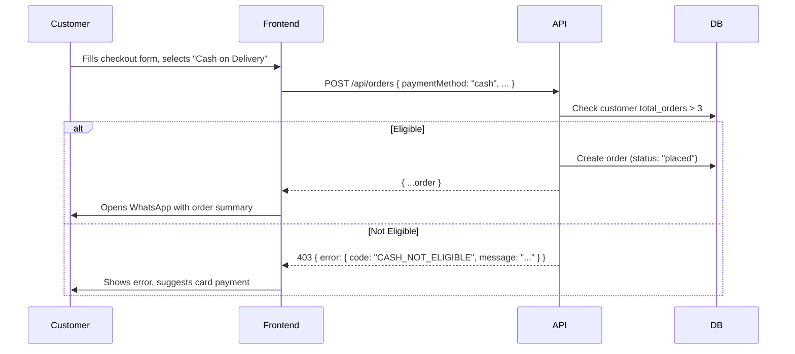

# Payments

## Overview

SoulFood supports two payment methods:

- **Card** — Online payment via Yoco Checkout (hosted payment page). Customer is redirected to Yoco, pays, then returns to the site.
- **Cash on Delivery** — Available to returning customers with more than 3 previous orders. New customers (≤3 orders) must pay by card.

## Payment Provider Architecture

Payments use a pluggable provider interface with a registry pattern:

```typescript
interface PaymentProvider {
  name: string
  createTransaction(orderId: number, amount: number): Promise<TransactionResult>
  verifyTransaction(txId: string): Promise<"completed" | "failed" | "pending">
  refund(txId: string): Promise<boolean>
}

interface TransactionResult {
  status: "pending" | "completed" | "failed"
  providerTxId: string | null
  redirectUrl?: string
}
```

Providers are registered at Worker startup in `index.tsx`:

```typescript
// index.tsx (first request middleware)
if (c.env.YOCO_SECRET_KEY) {
  registerProvider(new YocoProvider(c.env.YOCO_SECRET_KEY, siteUrl))
}
```

### CashProvider (built-in)

Simply marks transactions as pending immediately. Operator verifies on handover.

### YocoProvider

Created when `YOCO_SECRET_KEY` is set. On `createTransaction()`:
1. Calls Yoco Checkout API (`POST https://payments.yoco.com/api/checkouts`)
2. Amount is converted to cents (`amount * 100`)
3. Currency is always `ZAR`
4. Returns `redirectUrl` pointing to Yoco's hosted checkout page
5. Stores the Yoco checkout ID as `provider_tx_id`

## Order Flow by Payment Method

### Card Payment



### Cash on Delivery



## API Endpoints

| Method | Path | Auth | Description |
|--------|------|------|-------------|
| `POST` | `/api/orders` | Public | Creates order; returns `redirectUrl` for card payments |
| `POST` | `/api/webhook/yoco` | Public | Yoco payment notification webhook |
| `POST` | `/api/payments/transactions` | Admin | Create a transaction record |
| `GET` | `/api/payments/transactions` | Admin | List transactions (optional `?orderId=` filter) |

## Webhook Handler

Located at `/api/webhook/yoco`. Yoco sends a POST with:

```json
{
  "id": "checkout_abc123",
  "status": "completed",
  "metadata": { "orderId": "42" }
}
```

The handler:
1. Looks up the transaction by `provider_tx_id` (the checkout ID)
2. Updates the transaction status (`completed` or `failed`)
3. Updates the order's `payment_status` and `status` accordingly

## Cash Eligibility

Cash on delivery is restricted to customers with `total_orders > 3` (i.e. at least 4 completed orders). The check happens before the order is created, using the customer's current `total_orders` (before this order's increment).

## Environment Variables

| Variable | Required | Description |
|----------|----------|-------------|
| `YOCO_SECRET_KEY` | For card payments | Yoco API secret key (`sk_test_...` or `sk_live_...`) |
| `YOCO_WEBHOOK_SECRET` | Optional | Yoco webhook signing secret (for verification) |
| `SITE_BASE_URL` | Yes | Public site URL for Yoco return redirects |

## Testing

Yoco provides test credentials:
- **Test secret key:** `sk_test_abc123...`
- **Test card:** `4000 0000 0000 0000` (any future expiry, any CVC)
- **3D Secure test card:** `4000 0000 0000 3220`

Set the test key in `.dev.vars` to test locally.

---

*Last updated: June 2026*
