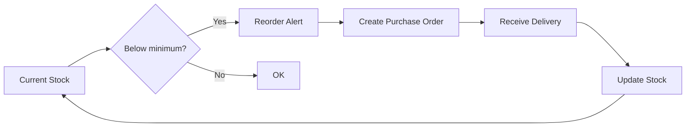

# Stock Management

## Introduction

Stock management tracks ingredients and supplies needed for dish preparation, ensuring timely reordering while preventing waste from overstocking.

## Inventory Categories

Stock items are organized into 5 categories (seeded automatically on first run):

| Category | What It Includes |
|---|---|
| **Ingredients** | All food items, raw materials, cooking components |
| **Utensils** | Cutlery, cooking tools (spatulas, ladles, spoons), knives, reusable kitchen tools |
| **Disposables** | Containers, plates, cups, serviettes/napkins, packaging materials, single-use items |
| **Hygiene** | Wipes, cleaning supplies, sanitizers, hand soap |
| **Utilities** | Gas, electricity, water — operational utilities |

The admin stock page includes category tabs for quick filtering and a category dropdown on the add/edit ingredient forms.

## Stock Level Management

### Reorder Logic

The system supports both automatic and manual reorder quantities:

- **Auto-calc:** If `max_stock_level` is set and `reorder_quantity` is empty, the suggested reorder is `max_stock_level - current_stock`
- **Manual:** If `reorder_quantity` is set, it is used as the default reorder amount regardless of current stock
- **Min stock alert:** Ingredients where `current_stock <= min_stock_level` are highlighted in red with a "Reorder" badge

## Stock Movements

Every stock adjustment is recorded in the `stock_movement_log` table with:

- Ingredient reference
- Adjustment amount (positive or negative)
- Stock level before and after
- Reason for the adjustment
- Timestamp

The admin stock page includes a "Log" button per ingredient to view movement history in a modal.

## Supplier Management

Suppliers are managed through the admin dashboard (`/admin/suppliers`). Each supplier record includes:

- Name, contact person, phone, email
- Lead time in days
- Active/inactive status

Active suppliers appear in dropdowns when creating ingredients and purchase orders.

## Purchase Orders

Purchase orders track procurement from suppliers. The admin interface (`/admin/purchase-orders`) supports:

1. **Create PO** — Select supplier, add line items (ingredient, quantity, unit price), multiple items via dynamic "Add Item" button
2. **List POs** — Table showing all POs with status, total, expected/received dates
3. **View PO** — Modal with full line-item details and calculated totals
4. **Receive PO** — Mark as received, which automatically:
   - Updates ingredient stock levels (+quantity_received)
   - Records stock movements with reason "Purchase order #N received"
   - Sets PO status to "received" with timestamp

## API Endpoints

| Method | Path | Description |
|---|---|---|
| `GET` | `/api/stock/ingredients` | List all ingredients |
| `POST` | `/api/stock/ingredients` | Add new ingredient |
| `PATCH` | `/api/stock/ingredients/:id/stock` | Adjust stock level (add/remove) |
| `GET` | `/api/stock/ingredients/:id/history` | Stock movement history |
| `GET` | `/api/stock/suppliers` | List suppliers |
| `POST` | `/api/stock/suppliers` | Add supplier |
| `GET` | `/api/stock/purchase-orders` | List purchase orders |
| `POST` | `/api/stock/purchase-orders` | Create purchase order |
| `PATCH` | `/api/stock/purchase-orders/:id/receive` | Mark as received + update stock |

## Admin Features

1. **Inventory dashboard** — All ingredients with current levels, min/max, reorder qty, and alerts
2. **Stock adjustment** — Quick add/remove with reason field (logged to movement history)
3. **Reorder alerts** — Red-highlighted rows for items below minimum with auto-calculated reorder qty
4. **Ingredient editor** — Edit all fields including stock levels, cost, and supplier assignment
5. **Purchase orders** — Create, view, and receive POs; auto-updates stock on receive
6. **Supplier management** — Full CRUD for supplier records

---

*Last updated: June 2026*
