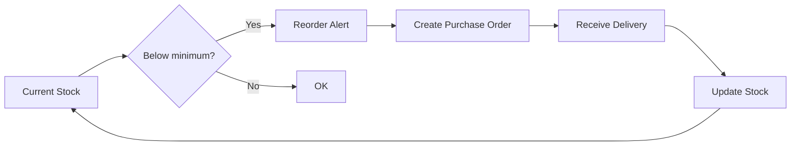

# Stock Management

## Introduction

Stock management tracks ingredients and supplies needed for dish preparation, ensuring timely reordering while preventing waste from overstocking.

## Inventory Categories

| Category | Examples |
|---|---|
| **Ingredients** | Meat, vegetables, spices, oils, grains |
| **Packaging** | Takeaway containers, bags, labels |
| **Disposables** | Napkins, cutlery, gloves |
| **Cleaning** | Sanitizer, detergents, cloths |
| **Tools** | Foil, baking paper, ties |

## Stock Level Management



### Reorder Logic

```
if current_stock <= min_stock_level:
    reorder_qty = max_stock_level - current_stock
    suggest_reorder(ingredient, reorder_qty)
```

## API Endpoints

| Method | Path | Description |
|---|---|---|
| `GET` | `/api/stock/ingredients` | List all ingredients |
| `POST` | `/api/stock/ingredients` | Add new ingredient |
| `PATCH` | `/api/stock/ingredients/:id` | Update ingredient details |
| `PATCH` | `/api/stock/ingredients/:id/stock` | Adjust stock level (add/remove) |
| `GET` | `/api/stock/ingredients/:id/history` | Stock movement history |
| `GET` | `/api/stock/suppliers` | List suppliers |
| `POST` | `/api/stock/suppliers` | Add supplier |
| `GET` | `/api/stock/purchase-orders` | List purchase orders |
| `POST` | `/api/stock/purchase-orders` | Create purchase order |
| `PATCH` | `/api/stock/purchase-orders/:id` | Mark as received |

## Admin Features

1. **Inventory dashboard** — All ingredients with current levels and alerts
2. **Stock adjustment** — Quick add/remove to reflect deliveries or usage
3. **Reorder alerts** — Visual indicators for items below minimum
4. **Purchase orders** — Track orders from draft to received
5. **Supplier list** — Contact info and lead times

---

*Last updated: June 2026*
