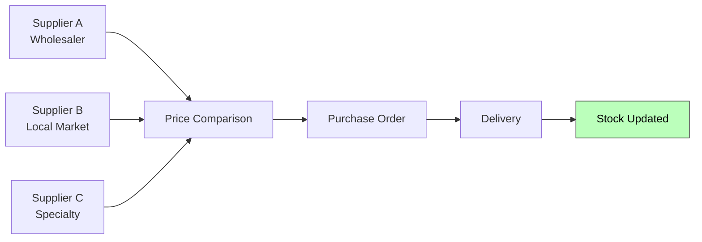

# Making Provision & Buying Ingredients

The provisioning and procurement processes ensure the kitchen has the right ingredients, accessories, and tools at the right time — balancing freshness, cost, and availability.

## Making Provision

Planning and forecasting to determine what needs to be ordered.

### Activities

| Activity | Description | App Support |
|---|---|---|
| **Inventory count** | Physical count of ingredients, packaging, disposables | Stock module — record current levels |
| **Critical levels** | Set min/max stock thresholds per ingredient | `ingredients.min_stock_level`, `max_stock_level` |
| **Menu planning** | Decide weekly specials based on ingredient availability | Menu module — toggle daily specials |
| **Grocery list** | Compile items needed to cover a period (week/month/quarter) | Purchase order draft |
| **Special orders** | Flag one-off items for catering events | Purchase order notes |

### Stock Level Logic

```
if current_stock <= min_stock_level:
    recommended_order_qty = max_stock_level - current_stock
    alert: "Reorder {ingredient.name} ({recommended_order_qty} {unit})"
```

## Buying Ingredients

Acquiring ingredients based on stock levels and special orders.

### Activities

| Activity | Description | App Support |
|---|---|---|
| **Supplier comparison** | Cross-examine prices across suppliers | Supplier list with price tracking |
| **Purchase order** | Create and send orders to suppliers | `purchase_orders` CRUD |
| **Delivery receipt** | Receive and verify goods against PO | `purchase_order_items.quantity_received` |
| **Stock update** | Increase current stock on receipt | `ingredients.current_stock` update |

### Supplier Management



## Data Model

### `ingredients`

| Column | Purpose |
|---|---|
| `current_stock` | What you have now |
| `min_stock_level` | Alert threshold |
| `max_stock_level` | Don't exceed this (freshness/waste) |
| `reorder_quantity` | Default amount to order |
| `unit_cost` | Latest known cost (for margin calc) |

### `purchase_orders`

Tracks orders from suppliers through receipt. Status flow:

```
draft → sent → received → cancelled
```

---

*Last updated: June 2026*
