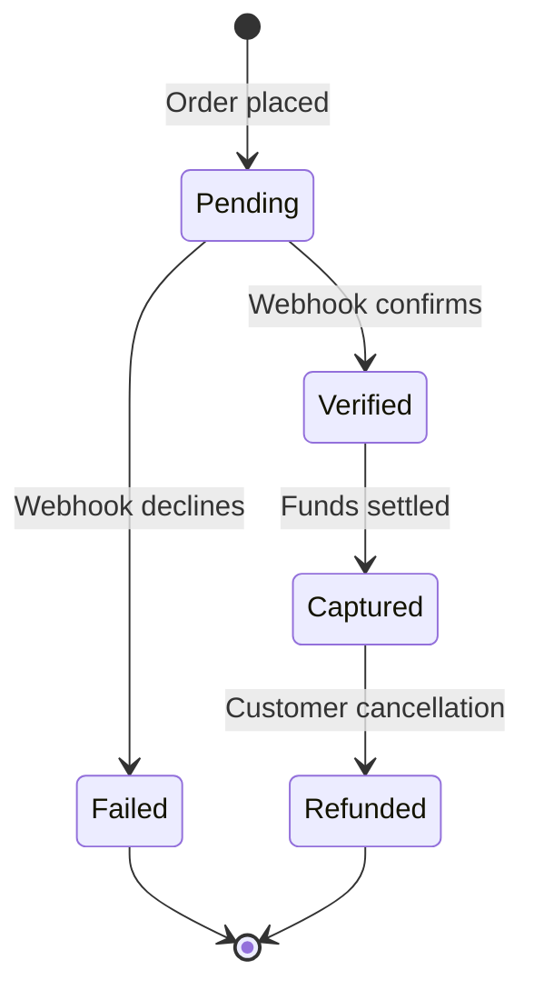

# Receiving Payment

> **Status:** Yoco Checkout (card) + Cash on Delivery (restricted) — both implemented.

Payment verification is the gate between order placement and kitchen preparation.

## Payment Methods

| Method | Eligibility | Flow |
|--------|-------------|------|
| **Card** (Yoco) | All customers | Redirect to hosted Yoco Checkout page, pay now |
| **Cash on Delivery** | Returning customers with `total_orders > 3` | Pay on handover, operator verifies |

## Payment Interface

Payments are handled via a pluggable provider interface:

```typescript
interface PaymentProvider {
  name: string
  createTransaction(orderId: number, amount: number): Promise<TransactionResult>
  verifyTransaction(txId: string): Promise<"completed" | "failed" | "pending">
  refund(txId: string): Promise<boolean>
}

interface TransactionResult {
  status: "pending" | "completed" | "failed"
  providerTxId: string | null
  redirectUrl?: string
}
```

New providers implement this interface and register in a provider registry:

```typescript
const providers = new Map<string, PaymentProvider>()
providers.set("cash", new CashProvider())
providers.set("card", new YocoProvider(secretKey, siteUrl))
```

## Transaction Lifecycle



## Status Descriptions

| Status | Meaning |
|---|---|
| `pending` | Awaiting provider confirmation |
| `verified` | Provider confirmed, funds held |
| `captured` | Funds settled (ready for payout) |
| `failed` | Transaction declined or errored |
| `refunded` | Funds returned to customer |

## Provider Implementations

### Cash on Delivery (built-in)

```typescript
class CashProvider implements PaymentProvider {
  name = "cash"

  async createTransaction(orderId: number, amount: number): Promise<TransactionResult> {
    return { status: "pending", providerTxId: null }
  }

  async verifyTransaction(txId: string): Promise<"completed" | "failed" | "pending"> {
    return "completed"
  }

  async refund(txId: string): Promise<boolean> {
    return true
  }
}
```

### Yoco (card) — implemented

See [Payments Feature](../features/payments.md) for full details.

### Planned Providers

- [ ] **PayFast** — SA EFT and card payments
- [ ] **Stripe** — International card payments

## Database

See [Database Schema](../database/schema.md) for the `transactions` table definition.

---

*Last updated: June 2026*
