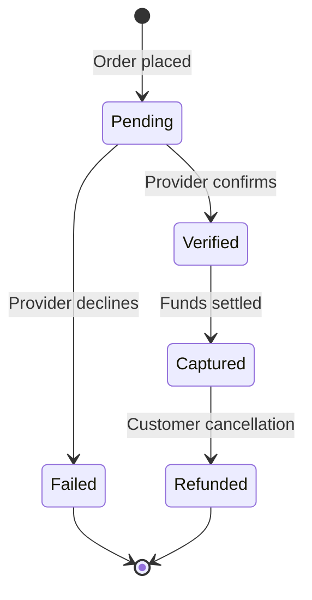

# Receiving Payment

> **Status:** Interface defined, provider-specific implementation pending.

Payment verification is the gate between order placement and kitchen preparation. No payment verification = no cooking starts.

## Payment Interface

Payments are handled via a pluggable provider interface:

```typescript
interface PaymentProvider {
  name: string
  createTransaction(order: Order): Promise<TransactionResult>
  verifyTransaction(txId: string): Promise<PaymentStatus>
  refund(txId: string): Promise<RefundResult>
}
```

New providers implement this interface and register in a provider registry:

```typescript
const providers = new Map<string, PaymentProvider>()
providers.set("cash", new CashProvider())
providers.set("yoco", new YocoProvider())
```

## Transaction Lifecycle



## Status Descriptions

| Status | Meaning |
|---|---|
| `pending` | Awaiting provider confirmation |
| `verified` | Provider confirmed, funds held |
| `captured` | Funds settled (ready for payout) |
| `failed` | Transaction declined or errored |
| `refunded` | Funds returned to customer |

## Provider Implementations

### Cash on Delivery (built-in)

```typescript
class CashProvider implements PaymentProvider {
  name = "cash"

  async createTransaction(order: Order): Promise<TransactionResult> {
    // No external call — mark as pending; operator verifies on handover
    return { status: "pending", providerTxId: null }
  }

  async verifyTransaction(txId: string): Promise<PaymentStatus> {
    // Operator manually marks as "verified" after receiving cash
    return "verified"
  }

  async refund(txId: string): Promise<RefundResult> {
    // Manual process
    return { success: true }
  }
}
```

### Planned Providers

- [ ] **Yoco** — SA card payment gateway (POS + online)
- [ ] **PayFast** — SA EFT and card payments
- [ ] **Stripe** — International card payments

## Database

See [Database Schema](../database/schema.md) for the `transactions` table definition.

---

*Last updated: June 2026*
