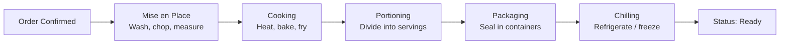
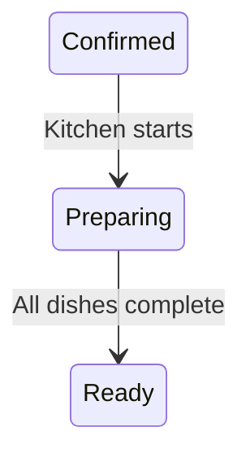

# Preparing Dishes

The kitchen process — turning ingredients into finished, packaged meals ready for delivery or pickup.

## Workflow

## Key Stages

### 1. Mise en Place

Before cooking begins: wash, chop, measure all ingredients. Prevents cross-contamination and ensures efficient cooking.

### 2. Cooking

Prepare food to safe internal temperatures. Methods vary by dish — stewing, frying, baking, grilling.

### 3. Portioning (Dishing)

Divide cooked food into individual servings. Best done while food is warm to ensure even distribution, but quickly to maintain quality.

### 4. Packaging

Seal food in containers appropriate for transport. Label with:
- Dish name
- Date and time prepared
- Use-by time
- Order ID

### 5. Chilling

For cold dishes or meals prepared in advance: refrigerate or freeze promptly to prevent bacterial growth.

## Status Transitions

The operator updates the order status as each stage completes:

## Activities

| Activity | Description | Recorded In |
|---|---|---|
| Assemble ingredients | Gather from stock | (kitchen manual) |
| Prepare (mise en place) | Wash, chop, measure | (kitchen manual) |
| Cook | Apply heat/cold methods | (kitchen manual) |
| Portion | Divide into servings | (kitchen manual) |
| Package | Seal and label containers | (kitchen manual) |
| Update status | Mark order as "Ready" | `orders.status` → `ready` |

---

*Last updated: June 2026*
