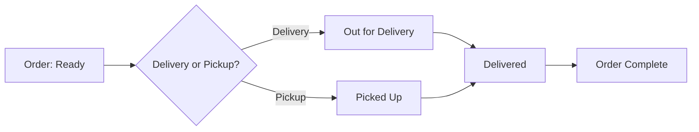
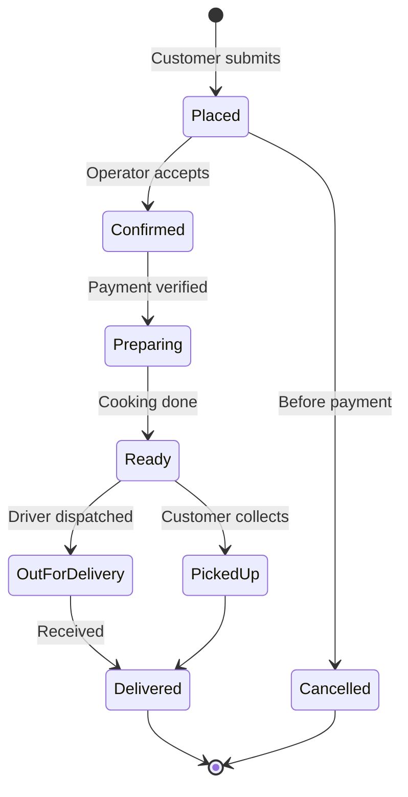

# Selling Dishes & Order Fulfillment

The final stage — getting completed orders to customers.

## Delivery Flow

## Order Lifecycle (Full)

## Activities

| Activity | Description | Trigger |
|---|---|---|
| **Receive order** | Incoming order alert | Customer submits via public site |
| **Confirm order** | Accept or reject | Operator action |
| **Update status** | Move through lifecycle | Operator at each stage |
| **Notify customer** | Status change alerts | Automatic on status transition |
| **Handle cancellation** | Refund if paid, cancel if not | Operator or customer |
| **Complete order** | Mark delivered/picked up | Driver or operator |

## Notifications

Notifications fire on each status transition:

| Transition | Customer Notified | Operator Notified |
|---|---|---|
| `placed` | Order confirmation | New order alert |
| `confirmed` | Order accepted | — |
| `preparing` | Being prepared | — |
| `ready` | Ready for pickup/delivery | — |
| `out_for_delivery` | On the way | — |
| `delivered` | Enjoy your meal! | Order complete |
| `cancelled` | Cancellation notice | Order cancelled |

## The Online Storefront

The customer-facing experience flows through:

1. **Browse** — Menu on the Hugo site with categories and descriptions
2. **Select** — Add dishes to cart (quantities, special instructions)
3. **Order** — Submit order with customer info and delivery/pickup choice
4. **Pay** — Payment via integrated provider (or cash on delivery)
5. **Wait** — Track order status via status page
6. **Receive** — Pickup or delivery

---

*Last updated: June 2026*
