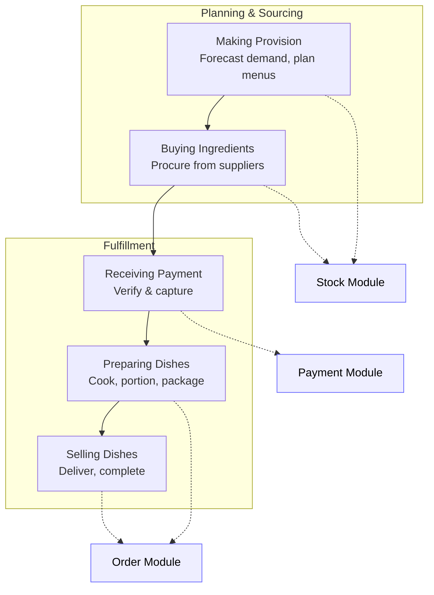
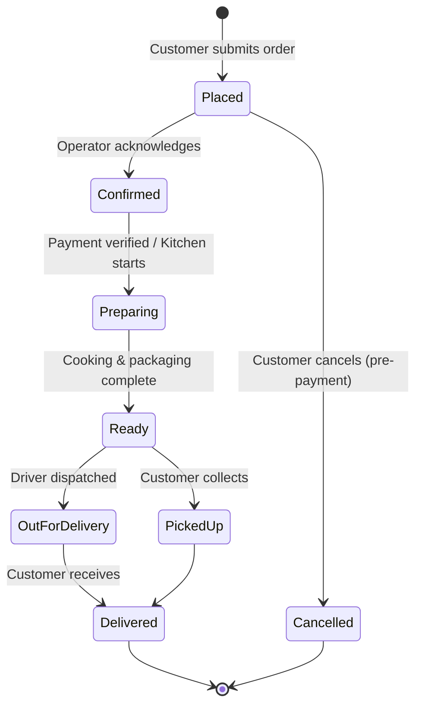

# Business Processes

SoulFood's operations follow a five-step workflow that starts with planning and ends with delivery. Each step maps to specific app features and database tables.

## Process Flow

## Process Details

| # | Process | App Module | Key Tables | Owner |
|---|---|---|---|---|
| 1 | [Making Provision](01-provisioning.md) | `features/stock/` | `ingredients`, `suppliers` | Manager |
| 2 | [Buying Ingredients](01-provisioning.md) | `features/stock/` | `purchase_orders`, `purchase_order_items` | Manager |
| 3 | [Receiving Payment](02-payment.md) | `features/payments/` | `transactions`, `orders` | System / Customer |
| 4 | [Preparing Dishes](03-preparation.md) | `features/orders/` | `orders`, `order_status_log` | Kitchen |
| 5 | [Selling Dishes](04-order-fulfillment.md) | `features/orders/` | `orders`, `order_items` | Operator |

## Order Lifecycle (End-to-End)

---

*Last updated: June 2026*
